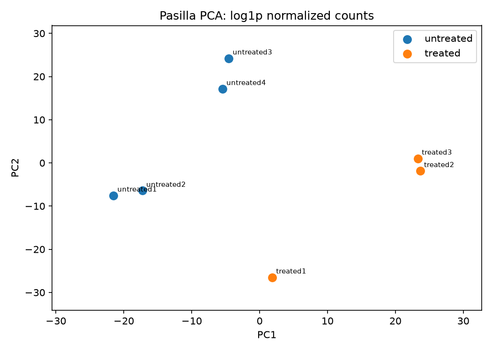
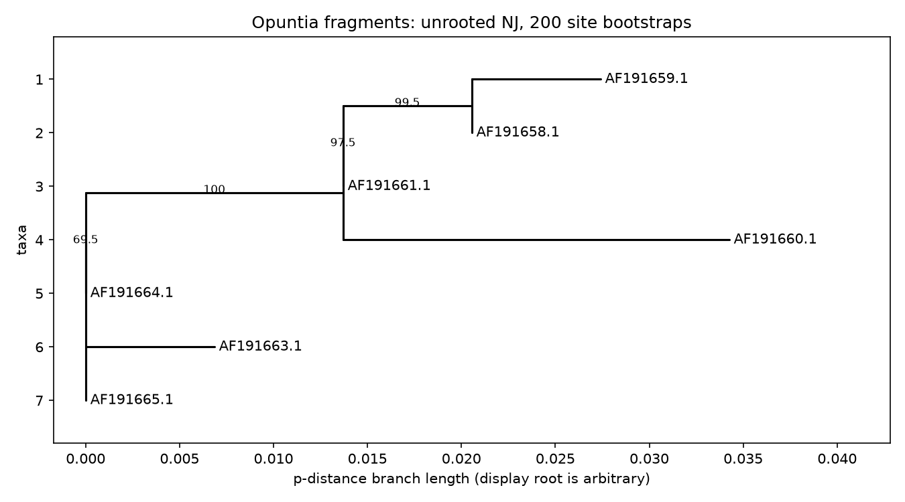

[Azərbaycan dili](README.md) · [English](README.en.md)

# Bioinformatics Research Lab

**Learn the biology. Build the analysis. Test the result. Ask the next question.**

An Azerbaijani-first, reproducible bioinformatics laboratory with small real datasets, executable Python projects, teaching notebooks, preserved results, and scientific controls. Code and standard scientific terms remain in English so learners can move from this repository to primary tools and literature.

[Start here](docs/START_HERE.md) · [Projects](projects/README.md) · [Notebooks](notebooks/README.md) · [Results](results/README.md) · [320-term AZ–EN glossary](docs/glossary.md) · [PDF library](resources/books/README.md) · [Roadmap](roadmap/README.md)

| Runnable projects | Notebooks | PDF resources | Verification |
|:---:|:---:|:---:|:---:|
| 13 projects, 9 offline | 8 guided plus 8 reproducibility notebooks | 4 books plus an Azerbaijani practicum | 60+ tests, Linux and Windows CI |

The figures below are stored outputs from actual analyses. They are accompanied by source records, parameters, limitations, and checksums.

| Pasilla RNA-seq | Opuntia phylogeny |
|:---:|:---:|
| [](results/research-audit/projects/rnaseq/pca.png) | [](results/expanded-projects/phylogeny/tree.png) |

## Quick start

Python 3.12 is recommended. Run these commands at the repository root:

```bash
python -m venv .venv
python -m pip install -e ".[dev]"
biolab list
biolab run alignment --offline
```

Use `uv sync --locked --extra dev --extra research` for the exact cross-platform environment recorded in `uv.lock`. The historical `requirements-tested.txt` remains audit evidence for one Windows environment; it is not the current dependency contract.

## What is reproducible here

- Each project writes a new run directory rather than overwriting an old result.
- `run.json` records input hashes, parameters, package versions, source hashes, status, and output hashes.
- CI tests Python 3.11 and 3.12, a locked environment, and the offline suite on Windows.
- Statistical controls include held-out evaluation, nested cross-validation, permutation tests, bootstrap uncertainty, and multiple-testing correction where appropriate.

The repository is an educational and research baseline. A high benchmark score is not clinical validation. Small datasets, selected methods, and technical study design limit every conclusion; individual project pages state those boundaries.

The learning library currently includes 20 data-format guides, 38 database cards, 37 primary-paper notes, five extended statistics guides, and separate UNEC exercises and solutions.

## Presentation and media

[Animated 26-slide PowerPoint](docs/media/bioinformatics-lab-animated.pptx) · [Static PDF](docs/media/bioinformatics-lab-presentation.pdf) · [Illustrated quick start](docs/media/ILLUSTRATED_GUIDE.md) · [Two-minute preview](docs/media/repo-intro-preview.mp4)

## License and citation

Original software is licensed under [MIT](LICENSE). Original teaching prose, presentations, and author-created synthetic data are licensed under [CC BY 4.0](LICENSE-docs). Third-party books, source excerpts, biological datasets, and derivatives retain their own terms; see the exact [license scope and exclusions](LICENSING.md). Cite the repository with [CITATION.cff](CITATION.cff) and cite underlying datasets and tools separately.

See [CONTRIBUTING.md](CONTRIBUTING.md) for contribution rules and [SECURITY.md](SECURITY.md) for responsible reporting.
