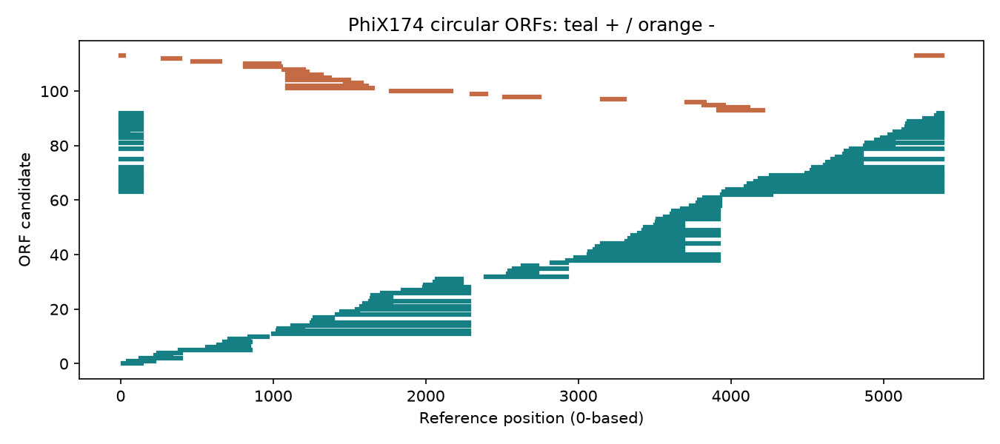
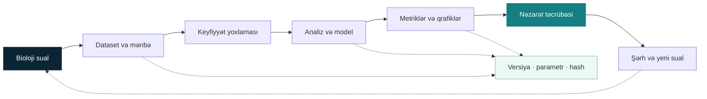

[Azərbaycan dili](README.md) · [English](README.en.md)

# Bioinformatics Research Lab

**Biologiyanı öyrən. Analizi qur. Nəticəni yoxla. Yeni sual yarat.**

Azərbaycan dilində bioinformatika laboratoriyası: kiçik real dataset-lər, işlək Python layihələri, izahlı notebook-lar və nəticəni sınayan elmi nəzarətlər. Kod və standart terminlər ingiliscədir.

**Avtomatik yoxlamalar:** [GitHub Actions](https://github.com/ali-novruz/bioinformatics-lab/actions/workflows/ci.yml)

**Lisenziya:** kod [MIT](LICENSE), layihənin orijinal tədris məzmunu [CC BY 4.0](LICENSE-docs). Xarici kitab və dataset istisnaları [lisenziya xəritəsində](LICENSING.md) göstərilir.

[**Başlanğıc bələdçisi**](docs/START_HERE.md) · [**Layihələr**](projects/README.md) · [**Notebook-lar**](notebooks/README.md) · [**Nəticələr**](results/README.md) · [**320 terminlik lüğət**](docs/glossary.md) · [**PDF kitabxanası**](resources/books/README.md) · [**Roadmap**](roadmap/README.md)

| 🧬 İşlək layihələr | 📓 Notebook-lar | 📚 PDF kitablar | 🧪 Yoxlamalar |
|:---:|:---:|:---:|:---:|
| **13** layihə · 9 offline | **16** notebook: öyrənmə + reproduksiya | **4** kitab + praktikum | **60+** test · Linux + Windows CI |

<sub>Rəqəmlər 2026-09-20 auditinə aiddir. Cari icra vəziyyəti və əhatə: <a href="STATUS.md">STATUS</a>.</sub>

## Təqdimat və şəkilli bələdçi

[](docs/media/README.md)

**[Animasiya əlavə edilmiş PowerPoint](docs/media/bioinformatics-lab-animated.pptx)** · [26 səhifəlik PDF](docs/media/bioinformatics-lab-presentation.pdf) · [6 addımlı şəkilli bələdçi](docs/media/ILLUSTRATED_GUIDE.md)

[2 dəqiqəlik səssiz video önizləməsi](docs/media/repo-intro-preview.mp4) · [Video ssenarisi və çəkiliş təlimatı](docs/media/VIDEO_GUIDE.md) · [Bütün tanıtım materialları](docs/media/README.md)

Təqdimatda proses sxemləri, redaktə edilən qrafik və cədvəllər, real analiz şəkilləri və danışıq qeydləri var. Animasiya PowerPoint-in Slide Show rejimində açılır. PDF statik nüsxədir.

## Analizlərə baxış

Aşağıdakı şəkillər repoda saxlanmış **faktiki analiz nəticələridir**. Şəkilə toxunaraq tam ölçüdə aça bilərsiniz.

| RNA-seq · nümunələrin müqayisəsi | Filogeniya · ardıcıllıqların əlaqəsi |
|:---:|:---:|
| [](results/research-audit/projects/rnaseq/pca.png) | [](results/expanded-projects/phylogeny/tree.png) |
| **Pasilla:** 7 nümunə; ifadə profilinin əsas dəyişmə istiqamətləri. [Analizi aç →](projects/intermediate/rnaseq/README.md) | **Opuntia:** 7 qısa fraqment, 146 tam sütun, 200 bootstrap. [Analizi aç →](projects/intermediate/phylogeny/README.md) |

| Maşın öyrənməsi · mənfi nəzarət | Genom · ORF namizədləri |
|:---:|:---:|
| [](results/research-audit/expression-control/permutation_control.png) | [](results/expanded-projects/orf-discovery/orfs.png) |
| **Khan:** 63 training nümunəsi; model seçimi hər fold daxilində təkrarlanır. [Nəzarət təcrübəsi →](experiments/controls/README.md) | **PhiX174:** 114 namizəd ORF; bunlar təsdiqlənmiş gen annotasiyaları deyil. [Analizi aç →](projects/beginner/orf-discovery/README.md) |

[**Bütün qrafiklər →**](visualizations/README.md) · [**Saxlanmış nəticələr və mənbələr →**](results/README.md)

## Sizin üçün başlanğıc yolu

| Məqsədiniz | Açın | İlk nəticəniz |
|---|---|---|
| Sıfırdan sistemli öyrənmək | [10 mərhələli roadmap](roadmap/README.md) | Biologiya → Python → real analiz |
| Bir layihəni işlətmək | [Quraşdırma](SETUP.md) və aşağıdakı əmrlər | Özünüzə aid yeni nəticə qovluğu |
| Dərsi praktikaya çevirmək | [UNEC praktikumu](docs/unec/README.md) | 8 dərs, 15 həftəlik plan, 24 cavablı tapşırıq |
| Elmi nəticəni tənqid etmək | [Tədqiqat auditi](docs/RESEARCH_AUDIT.md) | Fərziyyə, nəzarət, qeyri-müəyyənlik və limitlər |
| Növbəti tədqiqatı seçmək | [30 layihə ideyası](projects/IDEAS.md) | Dataset və qiymətləndirmə planı olan protokol |

## İlk analizi işlədin

Python 3.12 tövsiyə olunur; əsas paket Python 3.11-i də dəstəkləyir. Əmrləri repo kökündə icra edin.

```bash
python -m venv .venv
```

**Mühiti aktivləşdirin:**

| Windows PowerShell | Linux / macOS |
|---|---|
| `.venv\Scripts\Activate.ps1` | `source .venv/bin/activate` |

```bash
python -m pip install -e ".[dev]"
python scripts/lab.py list
python scripts/lab.py run alignment --offline
```

Bu ilk nümunə endirmə tələb etmir. Nəticələr `results/runs/` daxilində yeni, unikal qovluğa yazılır.

<details>
<summary><strong>Bütün layihələr, RNA-seq və yoxlama əmrləri</strong></summary>

Doqquz layihəni şəbəkəsiz işlədin:

```bash
python scripts/lab.py run all --offline
```

Bütün 13 layihə üçün əlavə analiz paketlərini quraşdırın. Qalan dörd layihənin ilk icrasında real girişlər endirilir:

```bash
python -m pip install -e ".[dev,research]"
python scripts/lab.py run all
python scripts/make_visualizations.py
```

Kod, notebook və nəticələri yoxlayın:

```bash
python -m pytest
python -m ruff check src scripts tests
python scripts/check_repository.py
python scripts/check_all_results.py
python scripts/validate_notebooks.py
```

Son notebook əmri real girişlərin əvvəlcədən endirilməsini tələb edir. Xam FASTQ workflow-ları üçün əlavə Linux/WSL/Conda alətləri lazımdır: [quraşdırma](SETUP.md) · [workflow bələdçisi](workflows/README.md).

</details>

## 13 işlək layihə

| İstiqamət | Layihələr | Nə əldə edirsiniz? |
|---|---|---|
| **Sequence analizi** | [DNA](projects/beginner/dna-analyzer/README.md) · [Alignment](projects/beginner/sequence-alignment/README.md) · [Filogeniya](projects/intermediate/phylogeny/README.md) · [ORF](projects/beginner/orf-discovery/README.md) | Kompozisiya, hizalama, ağac və namizəd protein ardıcıllıqları |
| **Genomika** | [Variant analizi](projects/intermediate/variant-analysis/README.md) | GIAB VCF prefix-i üzrə allel, filtr və keyfiyyət xülasəsi |
| **Transcriptomics** | [RNA-seq](projects/intermediate/rnaseq/README.md) · [GO enrichment](projects/intermediate/go-enrichment/README.md) · [SQLite kataloq](projects/beginner/study-database/README.md) | Gen ifadəsi modeli, funksional term analizi və sayım bazası |
| **Machine learning** | [WDBC təsnifatı](projects/intermediate/disease-classification/README.md) · [Khan gen ifadəsi](projects/intermediate/gene-expression-ml/README.md) | Training daxilində model seçimi və ayrılmış test nəticələri |
| **Statistika** | [Biostatistika laboratoriyası](projects/beginner/biostatistics-lab/README.md) | Null simulyasiyası, çoxsaylı testlər və BH düzəlişi |
| **Proteinlər** | [Sequence və struktur](projects/intermediate/protein-analysis/README.md) | UniProt sequence analizi, PDB strukturu və contact map |
| **Regional genetika** | [ClinVar variant prioritetləndirməsi](projects/advanced/regional-variant-interpretation/README.md) | İki açıq variant üçün izlənilə bilən, qeyri-klinik evidence triage |

**Xam oxunuşdan nəticəyə:** altı real yeast nümunəsində FASTQ → FastQC → STAR → featureCounts → PyDESeq2 yolu, ayrıca xarici DNA nümunəsində BWA → variant calling icra olunub. [İcra sübutlarını aç →](results/raw-examples/README.md)

## Laboratoriyada iş necə qurulur?



Hər nəticə üçün məlumatın mənşəyi, analiz parametrləri və məhdudiyyətlər saxlanır. [Konkret input → analiz → control əlaqələri](research/graph.json) ayrıca yoxlanır.

## Nəticəni yoxlamaq da layihənin bir hissəsidir

| Sual | Müşahidə | Sübutun sərhədi |
|---|---|---|
| Khan modeli qarışdırılmış etiketlərdən fərqlənirmi? | Nested balanced accuracy **0.99**; 99 permutation ortası **0.242**, p=**0.01** | 63 training nümunəsinin daxili auditi; klinik validasiya deyil |
| GO analizində bir seçilmiş genlə əhəmiyyətli nəticə mümkündürmü? | **84** mümkün singleton-un heç biri BH<0.05 vermir | Yalnız sabit universe və GO-slim term ailəsinə aiddir |
| Windows və Linux icraları uyğun gəlirmi? | 99 permutation score-u **1e-12** həddində uyğun gəlib | Yoxlanmış dataset, seed və mühitlər daxilində |

[**Təcrübələr və parametrlər**](experiments/controls/README.md) · [**Audit nəticələri**](results/research-audit/README.md) · [**Linux icra sübutu**](https://github.com/ali-novruz/bioinformatics-lab/actions/runs/35132816312)

## Kitabxana və UNEC praktikumu

**16 biologiya anlayışı · 20 data formatı · 38 database kartı · 37 məqalə qeydi · 320 termin · 9 mini-review**

| Oxu və öyrənmə | Təcrübə və araşdırma |
|---|---|
| [Biologiya və mövzu kitabxanası](docs/README.md) · [AZ–EN lüğət](docs/glossary.md) | [8 izahlı + 8 reproduksiya notebook-u](notebooks/README.md) |
| [4 PDF kitab və oxu planı](resources/books/README.md) | [UNEC: 8 dərs, 24 tapşırıq və ayrı həll açarı](docs/unec/README.md) |
| [Məqalə təhlilləri](research/papers/README.md) · [Mini-review-lər](research/literature-reviews/README.md) | [15 həftəlik proqram və dərslər](docs/unec/README.md) |
| [Databazalar və kurslar](resources/README.md) | [PDF praktikum](resources/unec/bioinformatika-praktikum.pdf) · [68 fayllıq mənbə kataloqu](resources/unec/README.md) |

## Repository xəritəsi

```text
bioinformatics-lab/
├── assets/readme/    Üz qabığı və vizual mənbə qeydi
├── docs/             Dərslər, bələdçilər və audit
├── datasets/         Məlumat kartları, kiçik girişlər və manifestlər
├── src/biolab/       Təkrar istifadə olunan analiz funksiyaları
├── scripts/          Endirmə, layihə icrası və yoxlamalar
├── workflows/        Xam FASTQ üçün Linux workflow-ları
├── projects/         13 işlək layihə və 30 əsas ideya
├── notebooks/        İzah və icra edilmiş hesablamalar
├── experiments/      Protokollar və nəzarət təcrübələri
├── results/          Saxlanmış nəticələr və icra sübutları
├── visualizations/   Qrafik qalereyası
├── research/         Məqalələr, suallar və tədqiqat əlaqələri
├── resources/        PDF-lər, UNEC materialları və mənbələr
└── roadmap/          Mərhələli öyrənmə yolu
```

<details>
<summary><strong>Elmi əhatə, texnologiyalar və inkişaf qaydası</strong></summary>

**Hazır olan:** tədris nümunələri, kiçik real dataset analizləri, 13 işlək layihə və mövcud nəticələri sınayan nəzarətlər. **Planlaşdırılan:** 30 ideyanın hamısının icrası, tam genom benchmark-ları və müstəqil cohort validasiyası.

Sintetik nümunələr, real analiz və gələcək protokollar ayrıca işarələnir. P-value effekt ölçüsü deyil; FDR, nümunə sayı, dizayn və qeyri-müəyyənlik birlikdə şərh edilir. Yüksək prediction score sabit biomarker və ya klinik fayda sübutu deyil. Məqalə qeydləri systematic review və bütün orijinal benchmark-ların reproduksiyası sayılmır.

**Python:** Biopython, NumPy, pandas, SciPy, matplotlib, scikit-learn, PyDESeq2 və Jupyter. **Xam data workflow-ları:** FastQC, Cutadapt, STAR, featureCounts, BWA, SAMtools və BCFtools.

Offline CI hər push/PR-də, endirməli integration və Linux smoke isə main push və manual icrada işləyir. Məlumatın accession/versiya, ölçü, hash və istifadə şərtləri dataset qeydlərindədir. Böyük xam girişlər Git-ə daxil edilmir.

[İcra vəziyyəti](STATUS.md) · [Dəyişikliklər](CHANGELOG.md) · [Töhfə qaydaları](CONTRIBUTING.md) · [Data siyasəti](DATA_POLICY.md) · [İstinad məlumatı](CITATION.cff)

</details>

---

<sub>Üz qabığı layihə üçün hazırlanmış dekorativ AI illüstrasiyasıdır; qalereyadakı qrafiklər isə qeyd olunmuş analizlərdən götürülüb. <a href="assets/readme/README.md">Vizual mənbə qeydi</a>.</sub>
