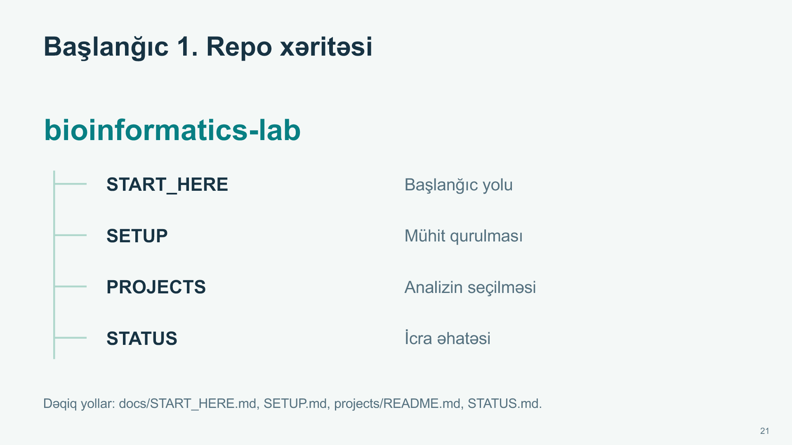
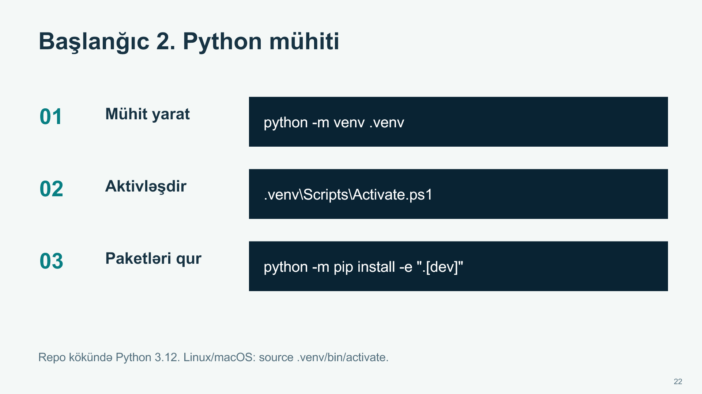
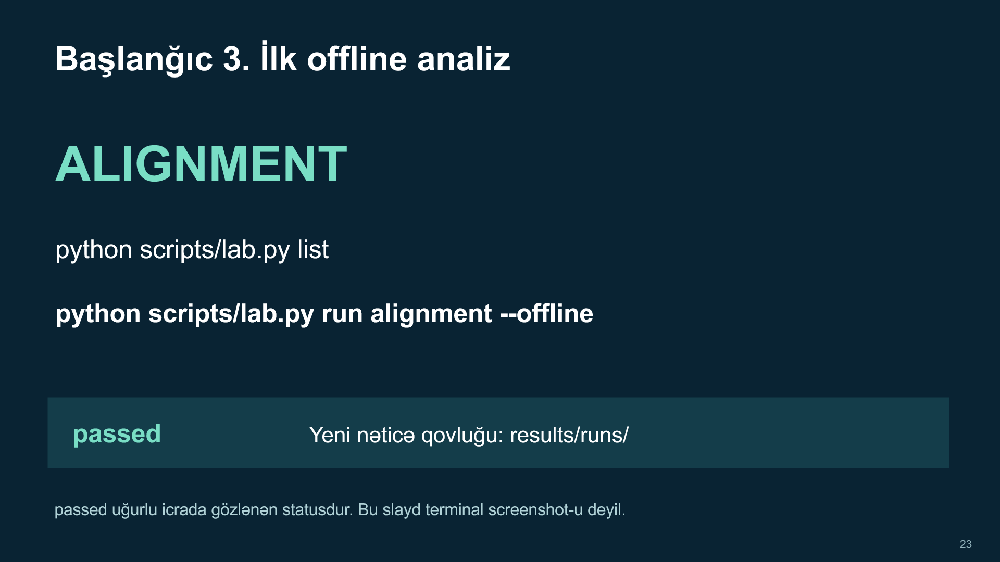
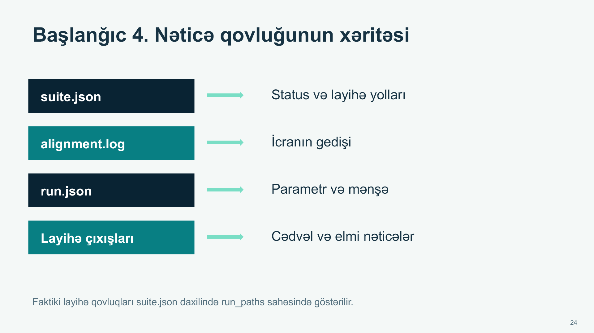
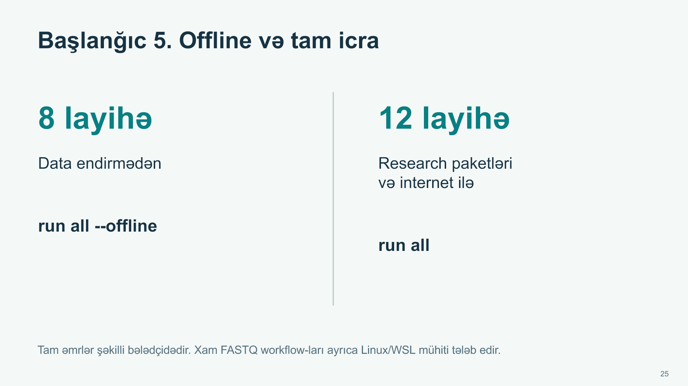
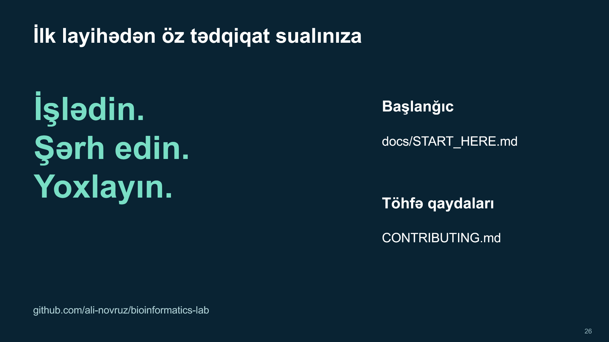

# Altı addımda başlanğıc

[PDF nüsxə](illustrated-quickstart.pdf) · [Animasiya əlavə edilmiş təqdimat](bioinformatics-lab-animated.pptx)

Bu şəkillər təlimat səhifələridir. Terminal və GitHub ekranının çəkilişi deyil. Əmrləri aşağıdakı mətn hissəsindən kopyalayın.

## 1. Repo xəritəsi



[Başlanğıc](../START_HERE.md), [quraşdırma](../../SETUP.md), [layihə kataloqu](../../projects/README.md) və [icra vəziyyəti](../../STATUS.md) səhifələrini açın. Giriş icazəniz olan hesabla reponu clone edin və ya ZIP-i endirin. Sonrakı əmrləri **repo kökündə** işlədin.

## 2. Python mühiti



Python 3.12 tövsiyə olunur. Windows PowerShell:

```powershell
python -m venv .venv
.venv\Scripts\Activate.ps1
python -m pip install -e ".[dev]"
```

Linux/macOS aktivləşdirməsi:

```bash
source .venv/bin/activate
```

Activation məhduddursa `.venv/Scripts/python.exe` yolunu birbaşa işlədin. İlk paket quraşdırılması internet tələb edir.

## 3. İlk offline analiz



```bash
python scripts/lab.py list
python scripts/lab.py run alignment --offline
```

Uğurlu icrada `alignment: passed` görünür. Nəticələr `results/runs/` altında yeni qovluğa yazılır. Qovluq adı hər icrada dəyişir.

## 4. Nəticənin oxunması



Yeni suite qovluğundakı `suite.json` faylında `status` və `projects` sahələrini yoxlayın. `projects` daxilindəki `run_paths` faktiki layihə nəticəsinə yönəldir. `alignment.log` icra gedişini, `run.json` isə parametr və mənşə məlumatını göstərir. Nəticədə input və metodun sualınıza uyğunluğunu ayrıca qiymətləndirin.

## 5. Səkkizdən on iki layihəyə



```bash
python scripts/lab.py run all --offline
python -m pip install -e ".[dev,research]"
python scripts/lab.py run all
```

İlk əmr 9 layihəni seçir, endirmə tələb edən 4 layihəni buraxır. Son əmr bütün 13 layihəni işlədir. RNA-seq research paketlərini tələb edir. Xam FASTQ workflow-ları üçün [ayrıca Linux/WSL təlimatı](../../workflows/README.md) var.

## 6. Öz sualınız və yoxlama



```bash
python -m pytest
python scripts/check_repository.py
python scripts/check_all_results.py
```

Yeni layihə əlavə edərkən bioloji sualı, dataset-i, metodu, qiymətləndirməni və məhdudiyyəti yazın. [Töhfə qaydalarına](../../CONTRIBUTING.md) əməl edin. Saxlanmış tarixi nəticələri yeni icra ilə səssizcə əvəz etməyin.

**İlk məşq:** alignment nəticəsindən istifadə olunan iki sequence-i və alignment metodunu tapın. Bir parametr dəyişsə score-un necə dəyişəcəyinə dair fərziyyə yazın, sonra yeni icra ilə sınayın.
