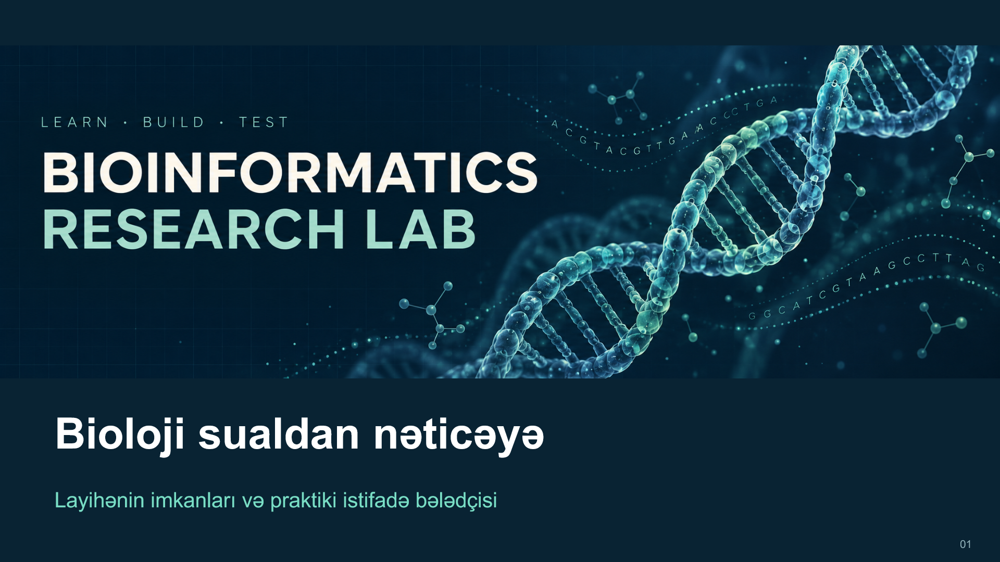

# Təqdimat və tanıtım paketi

## Hazır materiallar

| Material | Format və məzmun |
|---|---|
| [Animasiya əlavə edilmiş təqdimat](bioinformatics-lab-animated.pptx) | 26 slayd, redaktə edilən mətn, sxem və cədvəllər, native qrafik, danışıq qeydləri |
| [Təqdimatın PDF nüsxəsi](bioinformatics-lab-presentation.pdf) | 26 səhifəlik statik vizual baxış |
| [Şəkilli başlanğıc bələdçisi](ILLUSTRATED_GUIDE.md) | 6 PNG səhifəsi və kopyalana bilən əmrlər |
| [Bələdçinin PDF nüsxəsi](illustrated-quickstart.pdf) | Təqdimatın son 6 slaydı |
| [Tanıtım videosunun önizləməsi](repo-intro-preview.mp4) | 2 dəqiqə, səssiz, 12 səhnə, seçilə bilən Azərbaycan dili subtitrləri |
| [Video hazırlama təlimatı](VIDEO_GUIDE.md) | Tanıtım ssenarisi, ekran yazısı planı və montaj istiqaməti |
| [Subtitrlər](intro-az.srt) | Vaxt kodlu SRT faylı |
| [Səhnələr və danışıq mətni](video-storyboard.json) | 12 səhnə üzrə tam mətn və vaxt bölgüsü |
| [Təqdimatın mətn qeydləri](PRESENTATION_NOTES.md) | İzahlar, əmrlər və lokal mənbə keçidləri |

## Təqdimatdan istifadə

PowerPoint-də **Slide Show** rejimini açın. Hər slaydda elementlər yumşaq fade ilə mərhələli görünür, növbəti slayda kliklə keçilir. Native keçidlər və giriş animasiyaları PPTX faylının içindədir. PDF və PNG-lər statikdir. Tam təqdimat təxminən 20-25 dəqiqə üçün hazırlanıb.

Məzmunun dərinliyi danışıq qeydlərində saxlanır. Qrafiklər əvvəlki analizlərin şəkilləridir. Layihələrin offline/endirmə bölgüsünü göstərən dairəvi qrafik, cədvəllər və proses sxemləri PowerPoint obyektləri kimi redaktə edilir.

PDF-lər slaydların görüntü nüsxələridir. Axtarılan və kopyalanan mətn üçün [mətn qeydlərindən](PRESENTATION_NOTES.md), dəyişiklik üçün PPTX-dən istifadə edin. MP4 səsləndirilmiş ekran təlimatı deyil, montaj önizləməsidir.

## Məzmun xəritəsi

1. Layihənin məqsədi və təqdimat hazırlanarkən mövcud olan 12 layihənin xəritəsi; cari kataloq 13 layihədir
2. RNA-seq, WDBC, Khan, GO, filogeniya, ORF və protein nəticələri
3. Xam oxunuş workflow-ları və nəticələrin mənşəyi
4. UNEC materialları, oxu yolu və elmi məhdudiyyətlər
5. Gələcək tədqiqatlar və altı addımlı başlanğıc bələdçisi

Hazırlanma tarixi: **19 sentyabr 2026**. Elmi göstəricilər **16 sentyabr auditinə**, mənbə yolları `43ebcd8` vəziyyətinə əsaslanır. Bu paket gələcək işləri tamamlanmış nəticə kimi göstərmir.

[Dizayn, mənbələr və yoxlama qeydi](MEDIA_NOTES.md) · [Repo başlanğıcı](../START_HERE.md) · [İcra vəziyyəti](../../STATUS.md)
