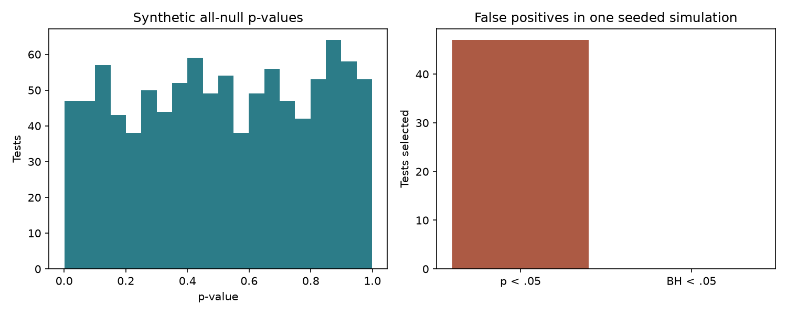

# Biostatistika: çoxsaylı testlər

```bash
python scripts/run_biostatistics_lab.py
```

İki ayrı hissə var: real yeast library totals xülasəsi və **sintetik** bütün-null eksperimenti. Sintetik nəticə bioloji gen kəşfi kimi təqdim edilmir.

Seed 20260916 ilə hər biri 20 müşahidədən ibarət iki standart normal qrup və 1000 xüsusiyyət yaradılır. Bütün null hipotezlər quruluş etibarilə doğrudur. Welch t-test və Benjamini-Hochberg düzəlişi tətbiq edilir.

Saxlanmış icrada **47** düzəlişsiz p<0.05, **0** BH-adjusted p<0.05 nəticə var. Kalibrə edilmiş null testlər üçün gözlənilən ilkin yanlış müsbət sayı 50-dir; hər icrada dəqiq 50 olması tələb edilmir. Sıfır BH nəticəsi hər dataset üçün zəmanət deyil.



Real 6 RNA library-si üzrə orta assigned fragment sayı 39,616.17, median 39,775.5, sample SD 411.80-dir. Bunlar QC xülasələridir; qruplar arasında gen ifadəsi fərqinin testi deyil.

[Nəticə cədvəli](../../../results/expanded-projects/biostatistics-lab/null_tests.csv), [xülasə](../../../results/expanded-projects/biostatistics-lab/summary.json), [anlayış və tapşırıqlar](../../../docs/unec/README.md).
