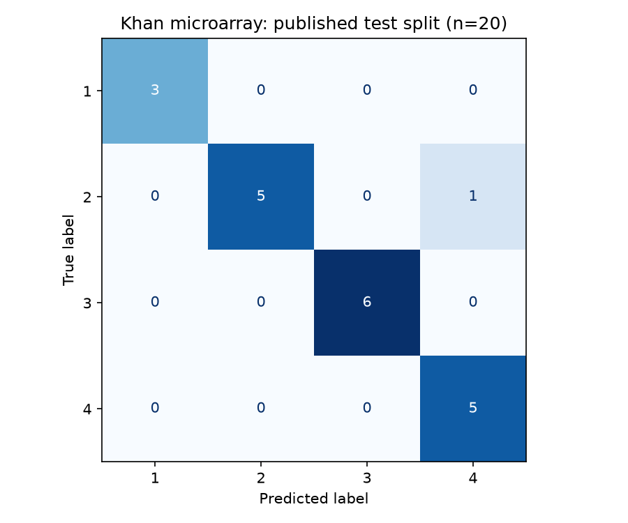

# Gen ifadəsindən şiş sinfinin təsnifatı

**Sual:** Khan mikroarray benchmark-ında training hissəsi ilə seçilmiş linear SVM verilmiş test hissəsində dörd sinfi ayıra bilirmi?

```bash
python scripts/fetch_khan.py
python scripts/run_expression_ml.py
```

Repo kökündə, [quraşdırılmış Python mühitində](../../../SETUP.md) işlədin. İlk icrada 4 CSV endirilir və hash-lər yoxlanır. Giriş: [dataset kartı](../../../datasets/public-datasets/khan.md). Hər icra yeni `results/runs/gene-expression-ml/` alt qovluğu yaradır.

## Metod

63 training / 20 test bölünməsi saxlanılır. VarianceThreshold → training fold daxilində ANOVA feature selection → StandardScaler → balanced linear SVM. Beşqat stratified CV-də k=25/100/500 və C=0.01/0.1/1 müqayisə edilir. Test seçim prosesinə daxil edilmir. Dummy most-frequent model başlanğıc müqayisədir. Sinif identifikatorları 1-4 saxlanılır.

## Faktiki nəticə

| Ölçü | Qiymət |
|---|---|
| Seçilən parametrlər | k=25; C=0.01 |
| Seçim üçün CV balanced accuracy | 1.0000 |
| Test accuracy | 0.9500, 19/20 düzgün |
| Test balanced accuracy | 0.9583 |
| Test macro F1 | 0.9545 |
| Dummy test balanced accuracy | 0.2500 |
| Şərti bootstrap accuracy intervalı | 0.85-1.00 |



Səhv: həqiqi sinif 2 olan bir nümunə sinif 4 proqnoz edilib. CV balı model seçimi üçün istifadə olunduğundan son qərəzsiz performans qiyməti kimi qəbul edilmir. Bootstrap intervalı yalnız bu sabit model və kiçik test dəsti üzrə şərtidir; cohort və model seçimi qeyri-müəyyənliyini tam əhatə etmir.

## Məhdudiyyət və genişlənmə

Tarixi işlənmiş mikroarray data-sı, cəmi 20 test nümunəsi, upstream preprocessing qeyri-müəyyənliyi və yoxlanmamış probe adları. Erkən diaqnostika, biomarker kəşfi və klinik istifadə nəticəsi çıxarılmır. Növbəti elmi mərhələ annotasiyalı, batch metadata-sı olan müstəqil cohort üzrə əvvəlcədən müəyyən edilmiş qiymətləndirmədir. Test balına görə cari grid dəyişdirilməyib.

[Saxlanmış nəticələr](../../../results/course-projects/gene-expression-ml), [UNEC dərsi](../../../docs/unec/handbook.md), [kod](../../../src/biolab/expression_ml.py).
