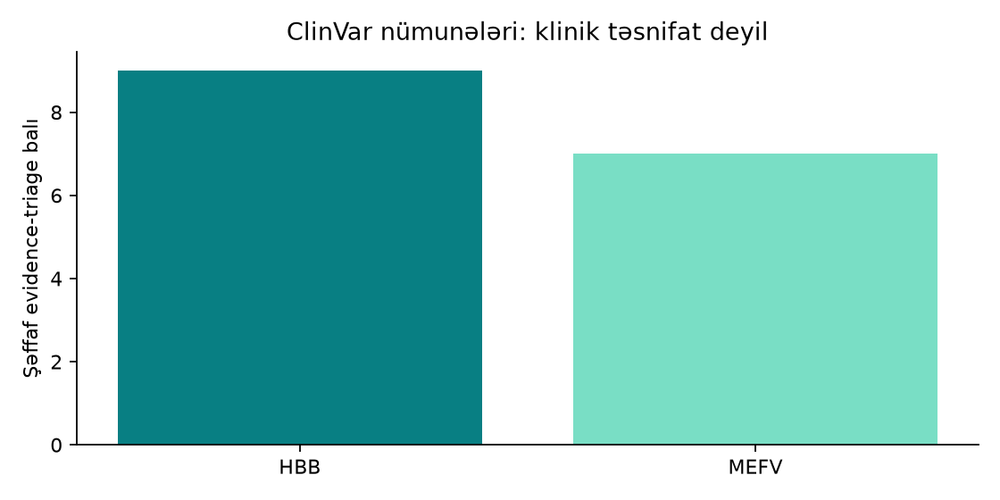

# Advanced layihələrin saxlanmış nəticələri

## Regional variant evidence triage

İki açıq ClinVar qeydi şəffaf tədris qaydası ilə prioritetləşdirilib. Input [TSV](../../datasets/examples/regional/clinvar-2026-09-20.tsv), onun xam [NCBI ESummary snapshot-u](../../datasets/source-snapshots/clinvar-2540-15333-2026-09-20.json) və çevirmə hash-i saxlanır.

| Nəticə | Fayl |
|---|---|
| 2 qeyd, HBB və MEFV | [summary.json](regional-variants/summary.json) |
| Evidence sahələri və ballar | [prioritized_variants.csv](regional-variants/prioritized_variants.csv) |
| Prioritet qrafiki | [priorities.png](regional-variants/priorities.png) |
| Mühit, input və source hash-ləri | [run.json](regional-variants/run.json) |

Bu nəticə **klinik təsnifat, diaqnoz və regional prevalence hesabı deyil**. İki seçilmiş qeyd Azərbaycan və ya Qafqaz populyasiyasını təmsil etmir. [Metod və sərhədlər](../../projects/advanced/regional-variant-interpretation/README.md).

[Snapshot](snapshot.json) yayımlanmış faylların dəqiq bayt hash-lərini saxlayır. Yeni icra köhnə nəticənin üzərinə yazılmamalıdır.
