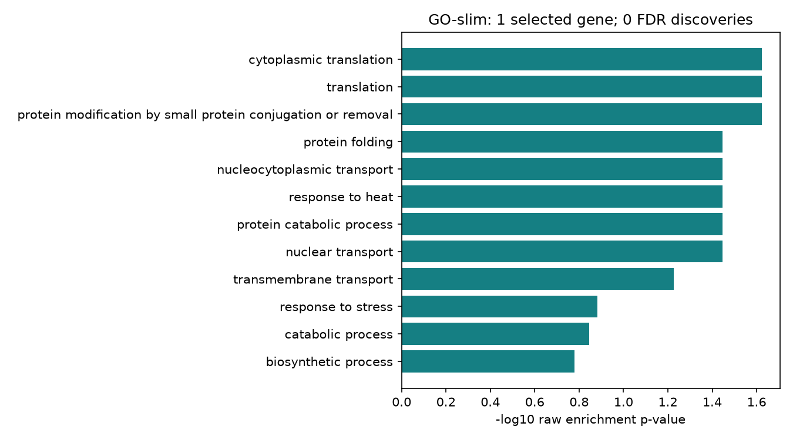

# 12 layihənin tam icrası və genişləndirmə nəticələri

`python scripts/lab.py run all` bütün 12 layihəni uğurla işlətdi. [Suite hesabatı](suite/suite.json) hər layihənin exit code-unu, [loglar](suite) isə icra çıxışını saxlayır. Hər layihə qovluğunda ayrıca `run.json` girişlərin, kodun və parametrlərin mənşəyini verir. Mətn fayllarında yalnız LF sətir sonları normallaşdırılıb. Yerli mühitdə data cache-i istifadə edilib; təmiz checkout-dan endirməli icra GitHub CI-də ayrıca yoxlanır.

| Layihə | Əsas nəticə | Xülasə |
|---|---|---|
| DNA | PhiX174 kompozisiyası | [JSON](dna/summary.json) |
| Alignment | NW/SW score-ları Biopython ilə uyğun | [JSON](alignment/summary.json) |
| Variant | Real GIAB ilk 1000 record üzrə filtr və allel xülasəsi | [JSON](variants/summary.json) |
| RNA-seq | Real pasilla count modeli | [JSON](rnaseq/summary.json) |
| WDBC ML | Training CV və ayrılmış test | [JSON](ml/summary.json) |
| Protein | P01308 sequence və ayrıca 1CRN strukturu | [JSON](proteins/summary.json) |
| Khan ML | 19/20 düzgün test proqnozu | [JSON](gene-expression-ml/summary.json) |
| SQLite | 6 nümunə × 124 gen = 744 qeyd | [JSON](study-database/summary.json) |
| Biostatistika | 47 nominal yanlış müsbət, 0 BH seçimi | [JSON](biostatistics-lab/summary.json) |
| GO enrichment | 84 background gen, 1 seçilmiş gen, 62 term, 0 FDR discovery | [JSON](go-enrichment/summary.json) |
| Filogeniya | 7 taxon, 146 tam/8 dəyişkən sütun, 200 bootstrap | [JSON](phylogeny/summary.json) |
| ORF axtarışı | 114 namizəd, 24 origin-i keçən, ən uzun 522 aa | [JSON](orf-discovery/summary.json) |

## Üç yeni qrafik



GO nəticəsi mənfidir: əhəmiyyətli enrichment tapılmayıb. Raw p-value qrafiki düzəlişli əhəmiyyət iddiası deyil.


Ağac köksüzdür; göstərilən kök mövqeyi görünüş üçündür. Fraqmentlər qısadır, tam növ filogeniyası kimi şərh edilmir.


ORF-lər namizəddir; təsdiqlənmiş gen sayını bildirmir. Nested başlanğıclar və iki strand saxlanılıb.

## Yoxlama

```bash
python scripts/check_all_results.py
python scripts/lab.py run all
```

[Snapshot](snapshot.json) yayımlanmış faylların dəqiq hash-lərini saxlayır. Hash yoxlaması ilə analizin yenidən işlədilməsi ayrı addımlardır. [Metodlar və testlər üzrə audit](../../docs/REPOSITORY_AUDIT.md).
