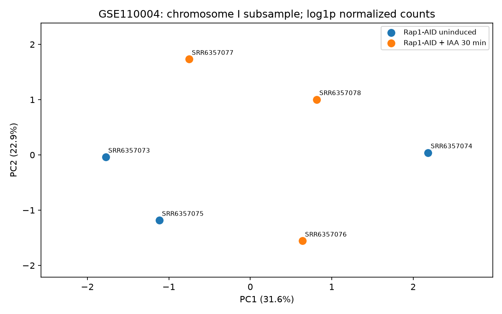
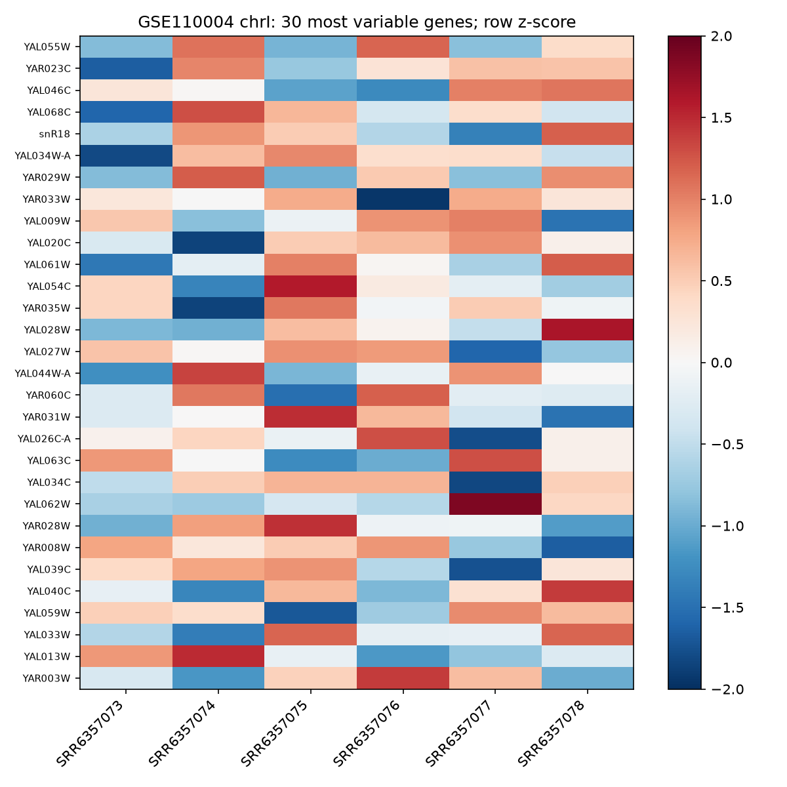
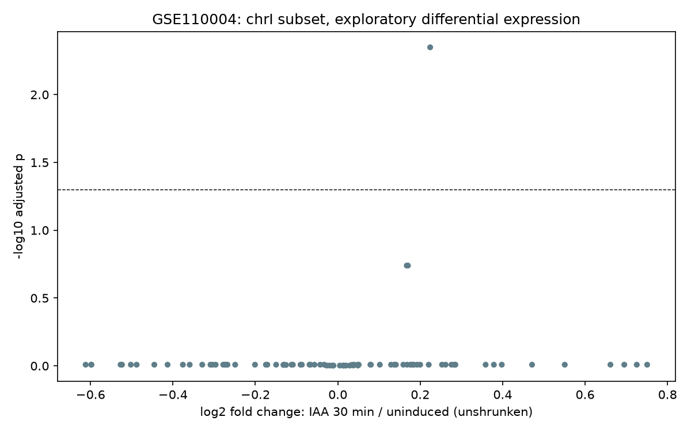

# Xam FASTQ-dan alınmış nəticələr — 2026-09-16

**Linux icrası uğurludur.** [Tam icra və artifact](https://github.com/ali-novruz/bioinformatics-lab/actions/runs/35045137065).
Kiçik nəticələr bu qovluqda daimi saxlanılır; artifact-in 14 günlük müddətindən asılı deyil.
[Snapshot manifesti](snapshot.json) ilkin commit və output SHA-256-larını göstərir.

## Real RNA-seq: GSE110004

Üç Rap1-AID uninduced və üç Rap1-AID + IAA 30 dəqiqə nümunəsi.
Hər nümunə chromosome I üçün əvvəlcədən seçilmiş 50,000 paired fragment-dir.
[Data kartı və mənbələr](../../datasets/public-datasets/raw-rnaseq.md).

| Sample | Qrup | Unikal hizalanma | Genə sayılmış fragment |
|---|---|---:|---:|
| SRR6357073 | Uninduced 1 | 82.74% | 38,989 |
| SRR6357074 | Uninduced 2 | 83.67% | 39,241 |
| SRR6357075 | Uninduced 3 | 84.48% | 39,727 |
| SRR6357076 | IAA 30 min 1 | 84.98% | 40,069 |
| SRR6357077 | IAA 30 min 2 | 84.70% | 39,847 |
| SRR6357078 | IAA 30 min 3 | 84.44% | 39,824 |

FastQC → STAR → featureCounts → gene-ID join → PyDESeq2 yolu tamamlandı.
124 input genindən 84-ü total count ≥10 filtrini keçdi.
`~ condition` modeli 1 gen üçün adjusted p<0.05 verdi; həm FDR<0.05,
həm də |log2FC|>1 şərtini keçən gen yoxdur.

YAL005C üçün log2FC=0.2241, adjusted p=0.00448:
statistik siqnal kiçik effektlə müşahidə olunur. Bu nəticə genome-wide discovery
və ya tam məqalə reproduksiyası deyil. PCA-da qruplar tam ayrılmır.
LFC shrinkage tətbiq edilməyib; sayımlar yalnız chromosome I subsample-ına aiddir.

- [Xam gene counts](rna-model/counts.tsv)
- [Bütün differential expression nəticələri](rna-model/differential_expression.csv)
- [Normalizə edilmiş counts](rna-model/normalized_counts.csv)
- [Sample metadata](rna-model/metadata.csv)
- [Maşınla oxunan xülasə](rna-model/summary.json)







## Xarici DNA inteqrasiya nümunəsi

nf-core/sarek kiçik normal sample-ın beş lane-i birləşdirildi.
2,761 cütdən 191-i trimming sonrası çox qısa olduğu üçün çıxarıldı;
2,570 cüt saxlanıldı. 5,139 ayrı read hizalandı.
32 variant qeydi çağırıldı, 27-si QUAL filtrindən PASS aldı.

[VCF](variants/filtered.vcf.gz), [variant statistikası](variants/variant_stats.txt),
[Cutadapt hesabatı](variants/cutadapt.txt), [xülasə](variants/summary.json).
Ploidy=2, mapping/base quality həddi=20, QUAL həddi=20.
PASS qiyməti patogenlik və ya truth-set uyğunluğu demək deyil.
Uyğun GFF3 olmadığı üçün consequence annotation icra edilmədi.
İlkin donor accession və truth set təsdiqlənmədiyindən bu nəticə software
inteqrasiya sübutudur. [Data kartı](../../datasets/public-datasets/raw-variants.md).

## Keyfiyyət qeydləri

[FastQC modul xülasəsi](qc_summary.tsv) bütün PASS/WARN/FAIL statuslarını saxlayır.

- RNA-nın 12 FASTQ faylında per-base quality və adapter content PASS-dır.
- RNA-da duplication və per-base sequence content FAIL-dır; overrepresented
  sequences WARN-dır. Transkript bolluğu, seçilmiş chromosome və RNA library bias
  bu göstəricilərə təsir edə bilər; bu statuslar gizlədilməyib.
- DNA raw read-lərdə per-base quality FAIL idi; quality trimming sonrası hər
  iki mate üçün PASS oldu. Adapter content PASS-dır, kit adapteri uydurulmadı.
- DNA GC distribution FAIL olaraq qalır. Kiçik seçilmiş region dəstində bunu
  bütün genomun GC paylanması ilə müqayisə etmək düzgün deyil; contamination
  bu hesabatla ayrıca istisna edilməyib.

GTF-də `not_in_genome` contig-li bir CDS sətri var. STAR/featureCounts bu icrada
`exon` feature-lərindən istifadə edir; exon contig-ləri chromosome I-ə aiddir.
Fayl dəyişdirilmədən hash ilə saxlanılıb; annotation bütün məqsədlər üçün
problemsiz canonical reference kimi təqdim edilmir.

## Təkrar icra və mühit

```bash
python scripts/run_raw_examples.py --output results/runs/raw-examples-002
```

[Quraşdırma](../../SETUP.md), [workflow](../../workflows/README.md),
[input manifest](input-manifest.json), [run metadata](run.json),
[Python paketləri](python-environment.txt), [sistem alətləri](system-packages.txt),
[Conda paket URL-ləri](conda-explicit.txt).
BAM, FASTQ və genome index bu snapshot-a daxil edilmir.
