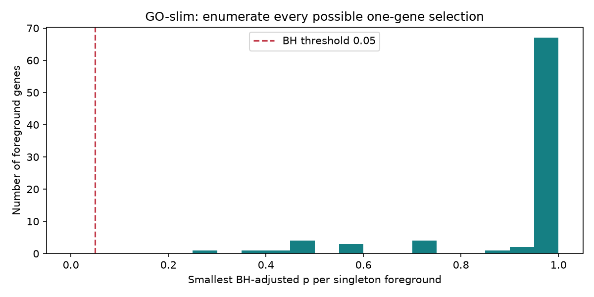
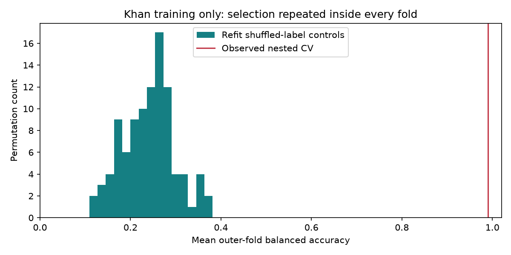

# Tənqidi auditin saxlanmış nəticələri

Tarix: 2026-09-16. [Audit və prioritetlər](../../docs/RESEARCH_AUDIT.md),
[eksperiment protokolu](../../experiments/controls/README.md).

| Təcrübə | Faktiki nəticə | İcra müddəti / mühit |
|---|---|---|
| [GO control](enrichment-control/summary.json) | 84 singleton, 62 term; 0 mümkün BH discovery; minimum q=0.2767857 | [run.json](enrichment-control/run.json) |
| [Khan control](expression-control/summary.json) | Nested balanced accuracy 0.99; dummy 0.25; 99 permutation mean 0.241936, p=0.01 | 102.61 s; Windows Python 3.12, [run.json](expression-control/run.json) |
| [12 layihənin ümumi icrası](suite/suite.json) | Hamısı exit 0, hər birinin run qovluğu və command/time qeydi var | Ümumi 42.00 s, cached verified inputs |
| [Custom RNA düzəlişinin real icrası](custom-rnaseq/summary.json) | GSE110004: 6 nümunə, 84 gen, 1 FDR; actual dataset/design başlığı | [Giriş və source qeydi](custom-rnaseq/run.json) |

Khan null-un mərkəzi 95% diapazonu 0.1375–0.362125-dir. Bu performance CI deyil.
Outer fold score-ları 1/0.95/1/1/1-dir; seçim Jaccard ortası 0.256909,
probe sayları 25/500/100/100/25. Bu nəticələr mövcud training materialının
robustness auditidir, yeni xarici cohort və klinik validasiya deyil.

## Şəkillər

## Nəticədən koda və dataya

[Validation qeydi](validation.json): 57 test, correctness lint, 8 icra edilmiş
notebook, qrafik qalereyası və bütövlük yoxlamaları. Windows Jupyter bağlanışında
transport/event-loop və libzmq mesajları verdi; bütün saxlanmış notebook-larda
cell-error sayı sıfırdır. Linux təmiz mühit icrası commit-in CI yoxlamasında ayrıca görünür.

- [Dondurulmuş protokol](../../experiments/controls/protocol.json) bütün seçimləri yazır.
- [Fold-lar](expression-control/folds.json) train/validation indekslərini, seçilmiş features və parametrləri saxlayır.
- [99 permutation](expression-control/permutations.csv) və [tam fit izləri](expression-control/permutation_folds.json) mənfi nəzarəti yoxlamağa imkan verir.
- [Singleton cədvəli](enrichment-control/singletons.csv) bütün 84 mümkün foreground nəticəsini göstərir.
- [Run path xəritəsi](run-paths.json) suite-dəki orijinal local run_paths-i bu
  repodakı daimi snapshot qovluqlarına bağlayır. Orijinal run.json və suite.json
  yol qeydləri dəyişdirilməyib; bu xəritə checkout-dan oxumaq üçündür.
- [Başlanğıc inventarı](baseline-inventory.json) **auditdən əvvəlki** fda0c35
  fayllarının hash-ləridir; cari fayl hash-i kimi istifadə edilməməlidir.
- [Snapshot](snapshot.json) saxlanmış icra fayllarının checksum-larını verir.
  `check_all_results.py` həmin hash-ləri və run daxilindəki output hash-lərini
  yoxlayır. Git bu qovluqda sətir sonlarını dəyişmir; icra baytları saxlanır.

Təkrar icra yeni qovluq yaradır. Source və data dəyişibsə, yeni nəticəni bu
snapshot üzərinə köçürmək əvəzinə ayrıca versioned experiment saxlayın.
Yüksək score üçün hiperparametrləri və discovery almaq üçün alfa həddini dəyişmək
bu auditin nəticəsini təsdiqləyən yeni sübut sayılmır.
