# Vizuallaşdırma qalereyası

`python scripts/make_visualizations.py` qrafikləri yaradır. 11 tələb olunan növ və əlavə contact map var. Raw-data xülasəsi, exploratory embedding və sintetik illüstrasiya başlıqlarda fərqləndirilir.

## Real PhiX GC pəncərələri

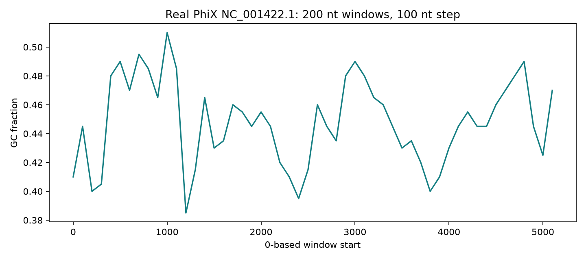

## Real GIAB genomik prefix; tam chromosome deyil

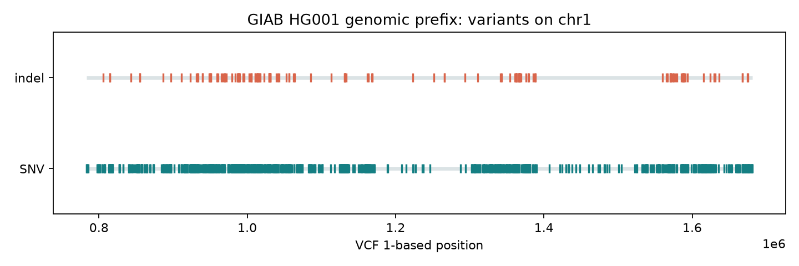

## Real pasilla PCA

## Real pasilla variable gene heatmap

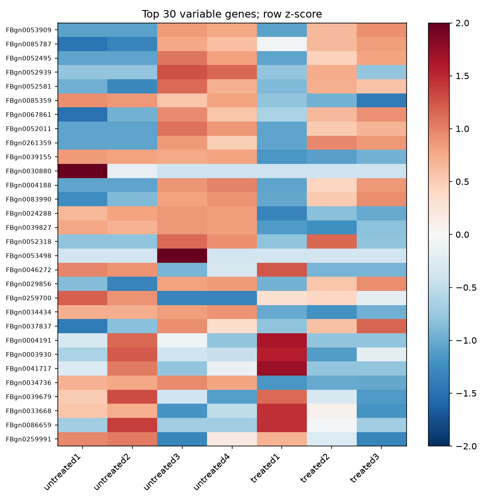

## Real pasilla DE volcano

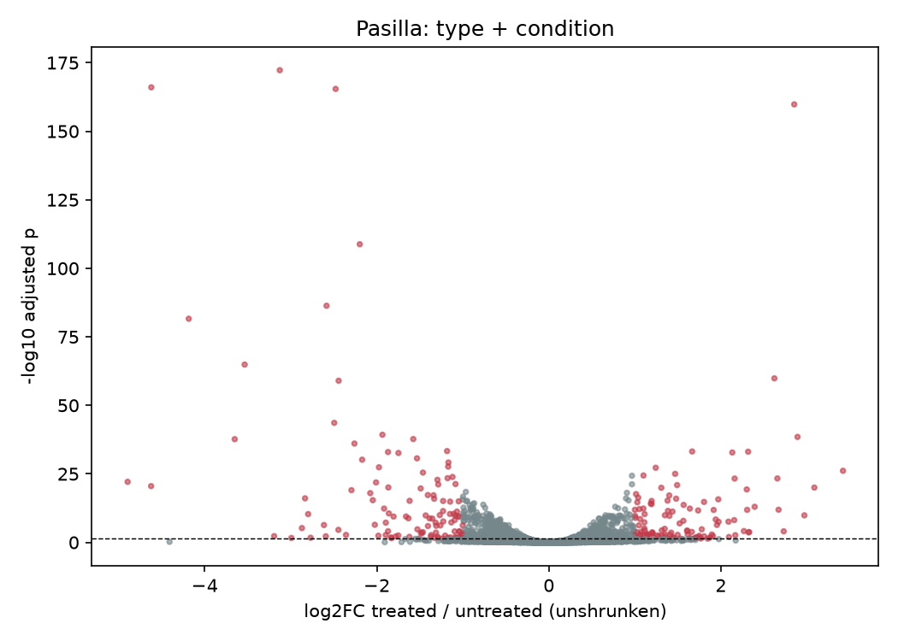

## Real WDBC exploratory UMAP

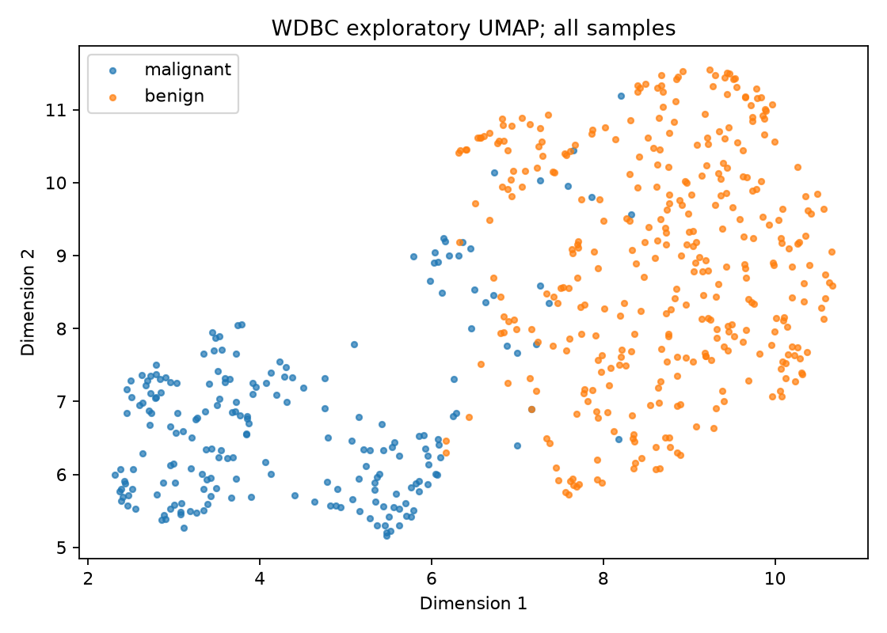

## Real WDBC exploratory t-SNE

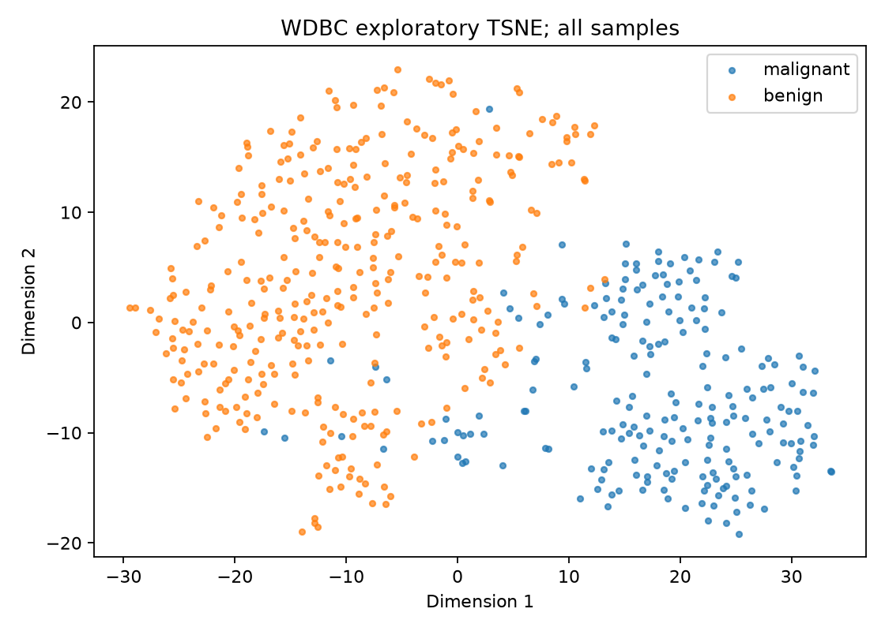

## Sintetik Manhattan; real GWAS deyil

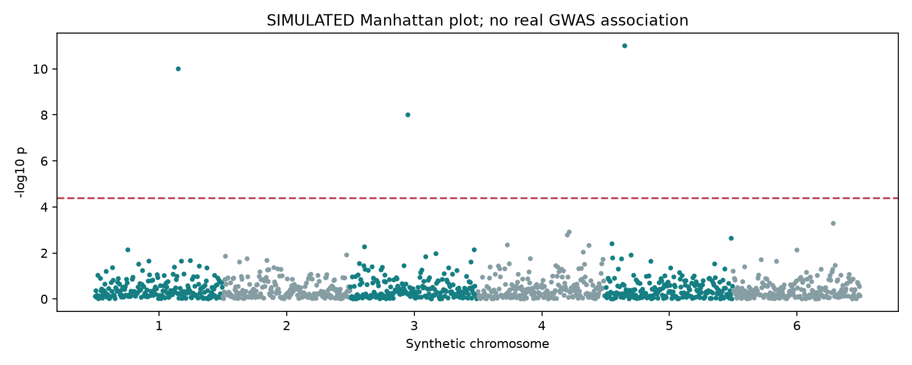

## İllüstrativ Newick tree; real filogenetik inference deyil

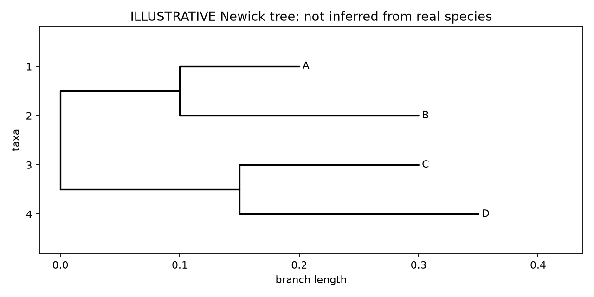

## Real 1CRN Cα structure trace

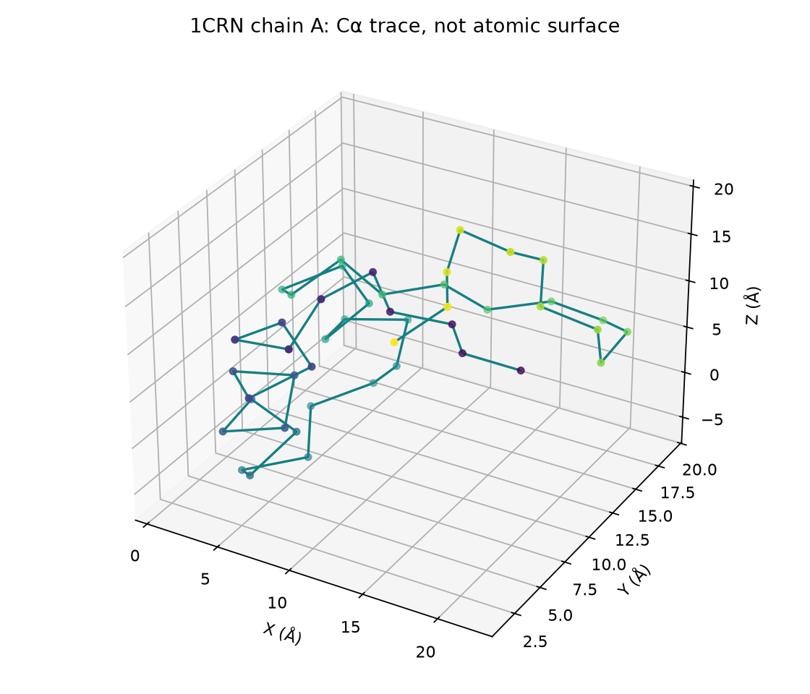

## Konseptual pathway; kurasiya edilmiş database network deyil

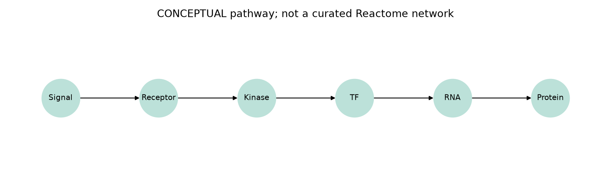

## Real 1CRN Cα distances

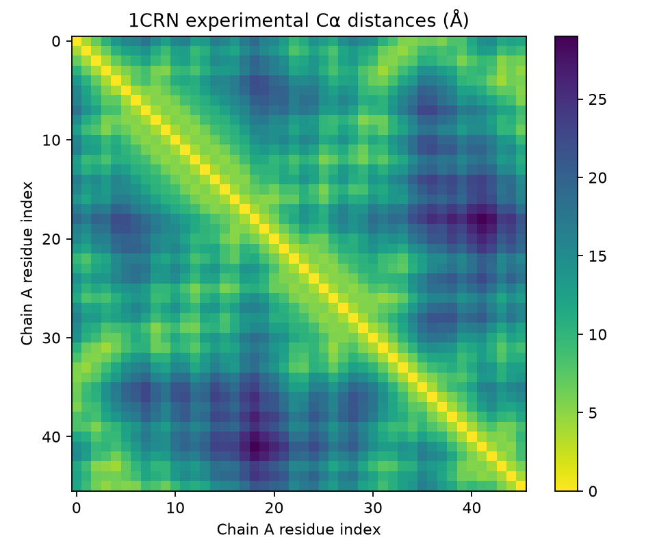

PCA log1p normalized counts-dur, VST deyil. WDBC UMAP/t-SNE bütün sample-larla yalnız vizual araşdırma üçündür; classifier training/test qiymətləndirməsinə daxil edilmir. [Provenance](gallery/provenance.json).
